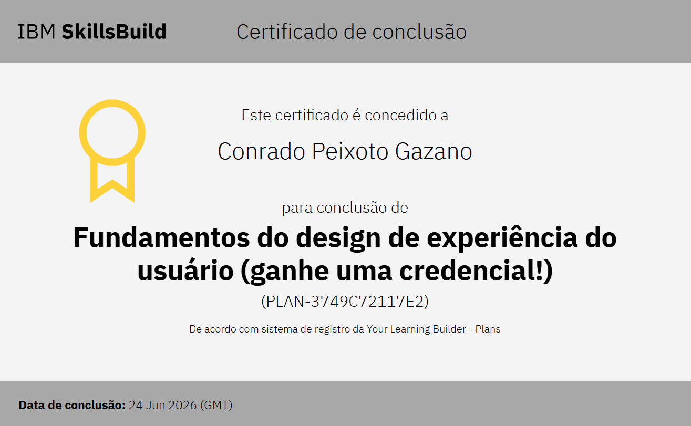
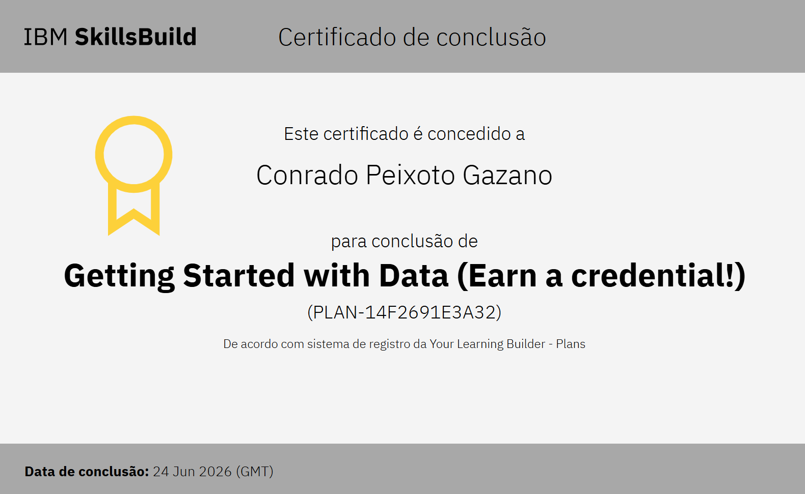
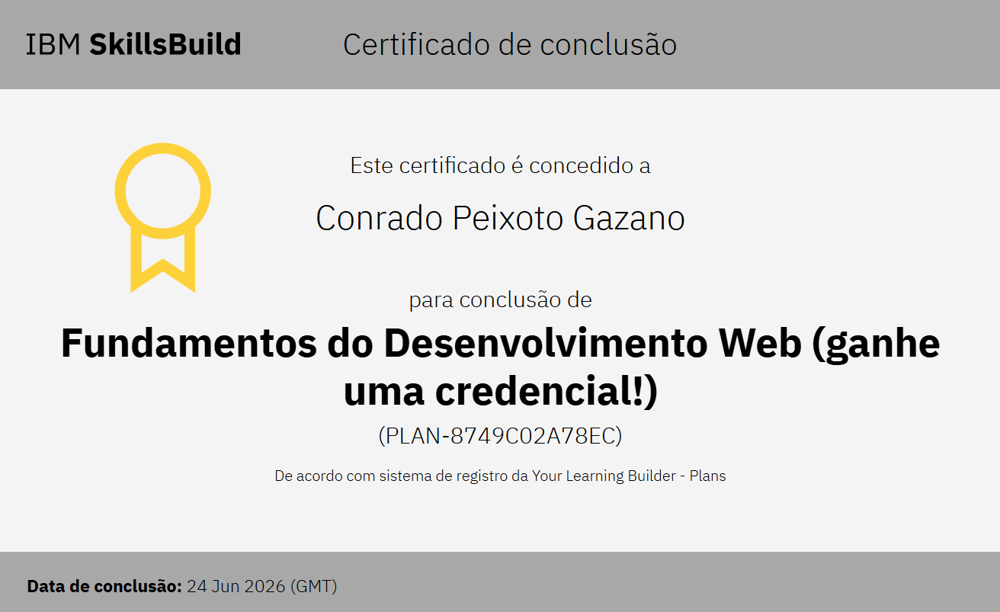
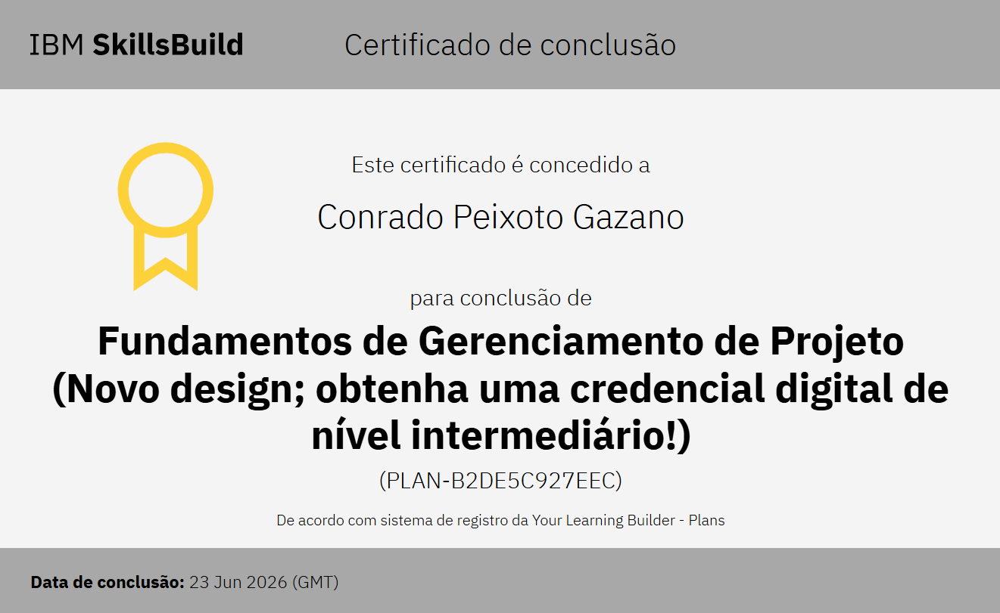

# Hello! I'm Conrado Gazano 👋

  

---

<h1 align="center">Certificados</h1>

---

### 🚀 About me
Here you can write a brief introduction about who you are, your current goals, and what excites you the most in the tech world.

- 🔭 Currently focusing on **school projects** and logic challenges.
- 📚 Expanding my knowledge in programming and new tools.
- ⚡ Fun fact: I learn new concepts very quickly!

---

### 🛠️ Tech Stack

---

### 📊 GitHub Stats

---

### 🤝 Let's connect

